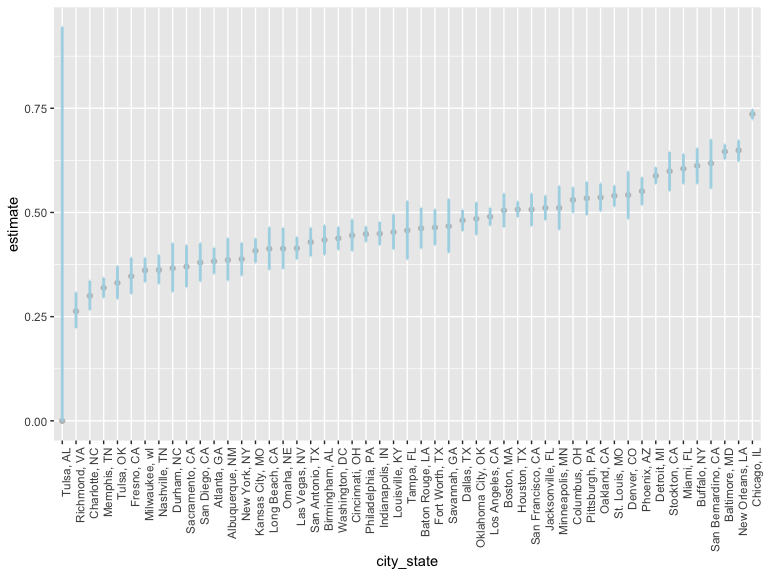
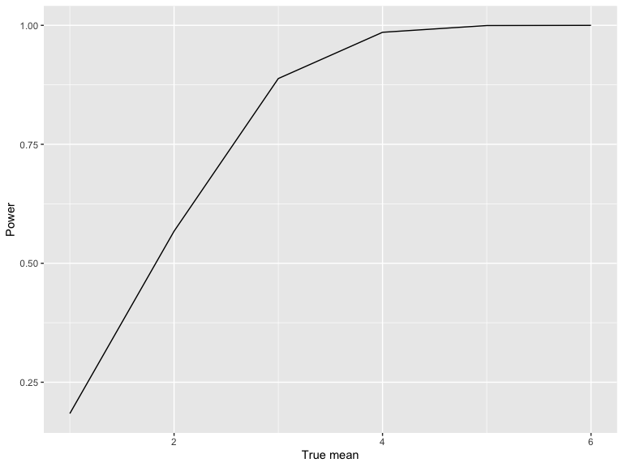
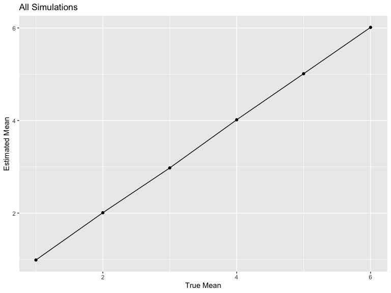
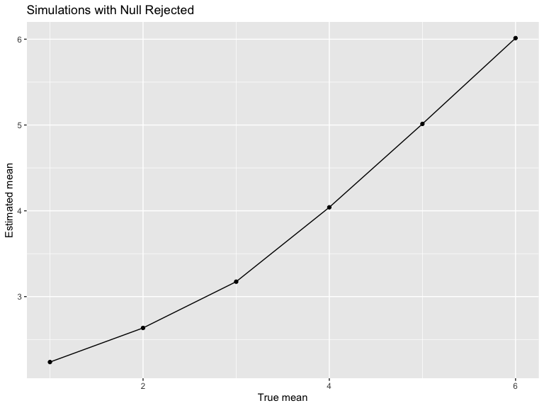

p8105_hw5_zz3039
================
2022-11-13

## Problem 2

Imported data:

``` r
homicide_data = 
  read.csv("./data/homicide-data.csv") %>% 
  janitor::clean_names() 
```

The raw data includes **12** variables, which are **uid, reported_date,
victim_last, victim_first, victim_race, victim_age, victim_sex, city,
state, lat, lon, disposition**, with **52179** observations as total.

Summed over number of cases:

``` r
homi_sum = 
  homicide_data %>% 
  mutate(
    city_state = paste(city, state, sep=", ")
  ) %>% 
  select(city_state, - city, - state, everything()) %>% 
  group_by(city_state) %>% 
  summarize(
    n_homicide = n(),
    n_unsolved = sum(disposition != "Closed by arrest"))
```

Prop.test for Baltimore:

``` r
balti = 
  homi_sum %>% 
  filter(city_state == "Baltimore, MD")

balti_test = 
  prop.test(balti$n_unsolved, balti$n_homicide) %>% 
  broom::tidy() %>% 
  mutate(
    conf.low = round(conf.low, digits = 3),
    conf.high = round(conf.high, digits = 3)
  )

tibble(
  balti_es = balti_test$estimate,
  balti_ci = paste(balti_test$conf.low, balti_test$conf.high, sep=", ")
)
```

    ## # A tibble: 1 × 2
    ##   balti_es balti_ci    
    ##      <dbl> <chr>       
    ## 1    0.646 0.628, 0.663

Prop.test for each city:

``` r
homi_prop = 
  homi_sum %>% 
  mutate(
    prop = 
      map2(.x = n_unsolved, .y = n_homicide, ~prop.test(x = .x, n = .y)),
    prop_test =
      map(prop, broom::tidy)) %>% 
  select(city_state, prop_test)
  

homi_prop_extrct = 
  homi_prop %>% 
  unnest(prop_test) %>%
  select(city_state, estimate, conf.low, conf.high) %>% 
  mutate(
    estimate = round(estimate, digits = 3),
    conf.low = round(conf.low, digits = 3),
    conf.high = round(conf.high, digits = 3),
    CI = str_c("(", conf.low,", ", conf.high, ")")) %>% 
  select(city_state, estimate, CI, everything())

print(homi_prop_extrct, n = 10)
```

    ## # A tibble: 51 × 5
    ##    city_state      estimate CI             conf.low conf.high
    ##    <chr>              <dbl> <chr>             <dbl>     <dbl>
    ##  1 Albuquerque, NM    0.386 (0.337, 0.438)    0.337     0.438
    ##  2 Atlanta, GA        0.383 (0.353, 0.415)    0.353     0.415
    ##  3 Baltimore, MD      0.646 (0.628, 0.663)    0.628     0.663
    ##  4 Baton Rouge, LA    0.462 (0.414, 0.511)    0.414     0.511
    ##  5 Birmingham, AL     0.434 (0.399, 0.469)    0.399     0.469
    ##  6 Boston, MA         0.505 (0.465, 0.545)    0.465     0.545
    ##  7 Buffalo, NY        0.612 (0.569, 0.654)    0.569     0.654
    ##  8 Charlotte, NC      0.3   (0.266, 0.336)    0.266     0.336
    ##  9 Chicago, IL        0.736 (0.724, 0.747)    0.724     0.747
    ## 10 Cincinnati, OH     0.445 (0.408, 0.483)    0.408     0.483
    ## # … with 41 more rows

Plot:

``` r
homi_prop_extrct %>% 
  mutate(
    city_state = fct_reorder(city_state, estimate)
  ) %>% 
  ggplot(aes(x = city_state, y = estimate)) +
  geom_point(color = "grey") +
  geom_errorbar(mapping=aes(x = city_state, ymin = conf.low, ymax = conf.high), width=0.05, size=1, color="light blue") +
  labs(
    x = "City and State",
    y = "Estimate Proportion"
  ) +
  theme(axis.text.x = element_text(angle = 90, hjust = 1))
```



## Problem 3

Wrote function and simmed:

``` r
p3_sim = function(n, mu, sigma = 5) {
  
  sim_data = tibble(
    x = rnorm(n, mean = mu, sd = sigma),
  )

  t_test =
    t.test(sim_data$x, alternative = "two.sided") %>% 
    broom::tidy()
  
  tibble(
    mu_hat = mean(sim_data$x),
    p_value = t_test$p.value
  )
}

output = vector("list", 5000)

for (i in 1:5000) {
  output[[i]] = p3_sim(n = 30, mu = 0)
}

sim_results = bind_rows(output)
sim_results
```

    ## # A tibble: 5,000 × 2
    ##    mu_hat p_value
    ##     <dbl>   <dbl>
    ##  1 -0.505  0.655 
    ##  2 -0.782  0.555 
    ##  3  0.357  0.708 
    ##  4 -0.756  0.370 
    ##  5  0.391  0.689 
    ##  6 -1.08   0.246 
    ##  7  1.25   0.242 
    ##  8  1.88   0.0401
    ##  9 -0.714  0.469 
    ## 10 -0.750  0.431 
    ## # … with 4,990 more rows

Repeated for different mus:

``` r
sim_results_mus = 
  expand_grid(
    sample_size = 30,
    mu = c(1, 2, 3, 4, 5, 6),
    iter = 1:5000
  ) %>% 
  mutate(
    estimate_df = map2(.x = sample_size, .y = mu, ~p3_sim(n=.x, mu=.y))
    ) %>% 
  unnest(estimate_df)

sim_results_mus
```

    ## # A tibble: 30,000 × 5
    ##    sample_size    mu  iter mu_hat p_value
    ##          <dbl> <dbl> <int>  <dbl>   <dbl>
    ##  1          30     1     1  0.305 0.749  
    ##  2          30     1     2  0.842 0.367  
    ##  3          30     1     3  1.62  0.0538 
    ##  4          30     1     4  0.186 0.859  
    ##  5          30     1     5 -0.242 0.796  
    ##  6          30     1     6  2.26  0.00840
    ##  7          30     1     7  0.929 0.317  
    ##  8          30     1     8  1.41  0.243  
    ##  9          30     1     9 -0.744 0.422  
    ## 10          30     1    10  2.47  0.00307
    ## # … with 29,990 more rows

Plot-power/mean

``` r
sim_results_mus %>% 
  group_by(mu) %>% 
  summarize(
    power = sum(p_value < 0.05)/5000
  ) %>% 
  ggplot(aes(x = mu, y = power)) +
  geom_line() +
  labs(
    x = "True Mean",
    y = "Power"
  )
```



The power of the test increases as the mu of the simulation increases.

Plot-estimated/true

``` r
sim_results_mus %>% 
  group_by(mu) %>% 
  summarize(
    mu_est = mean(mu_hat)
  ) %>% 
  ggplot(aes(x = mu, y = mu_est)) +
  geom_point() +
  geom_line() +
  labs(
    title = "All Simulations",
    x = "True Mean",
    y = "Estimated Mean"
  )
```



``` r
sim_results_mus %>% 
  filter(p_value < 0.05) %>% 
  group_by(mu) %>% 
  summarize(
    mu_est = mean(mu_hat)
  )%>% 
  ggplot(aes(x = mu, y = mu_est)) +
  geom_point() +
  geom_line() +
  labs(
    title = "Simulations with Null Rejected",
    x = "True mean",
    y = "Estimated mean"
  )
```



The sample average of mu across tests for which the null is rejected is
not close to the true value of mu, because the t.test told us that under
a 0.95 significant level, we believe that the true mu of their
population is not 0.
