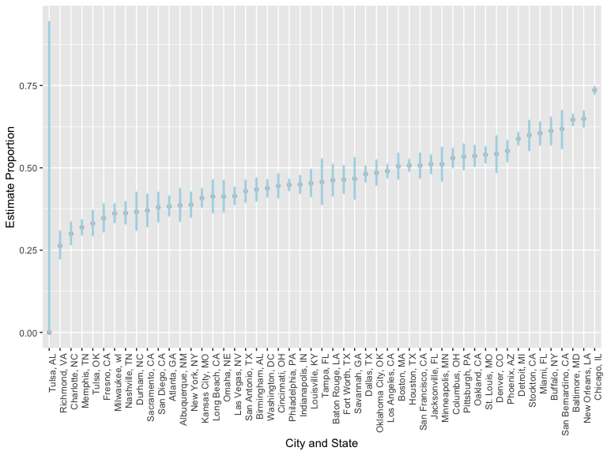

p8105_hw5_zz3039
================
2022-11-13

``` r
library(tidyverse)
library(purrr)

knitr::opts_chunk$set(
    echo = TRUE,
    warning = FALSE,
    fig.width = 8, 
  fig.height = 6,
  out.width = "90%")

options(
  ggplot2.continuous.colour = "viridis",
  ggplot2.continuous.fill = "viridis")
```

## Problem 1

Import data

``` r
homicide_data = 
  read.csv("./data/homicide-data.csv") %>% 
  janitor::clean_names() %>% 
  mutate(
    city_state = paste(city, state, sep=", ")
  ) %>% 
  select(city_state, - city, - state, everything())
```

Sum over number of cases

``` r
homi_sum = 
  homicide_data %>% 
  group_by(city_state) %>% 
  summarize(
    n_homicide = n(),
    n_unsolved = sum(disposition != "Closed by arrest"))
```

Prop.test for baltimore

``` r
balti = 
  homi_sum %>% 
  filter(city_state == "Baltimore, MD")

balti_test = 
  prop.test(balti$n_unsolved, balti$n_homicide) %>% 
  broom::tidy() %>% 
  mutate(
    conf.low = round(conf.low, digits = 3),
    conf.high = round(conf.high, digits = 3)
  )

tibble(
  balti_es = balti_test$estimate,
  balti_ci = paste(balti_test$conf.low, balti_test$conf.high, sep=", ")
)
```

    ## # A tibble: 1 × 2
    ##   balti_es balti_ci    
    ##      <dbl> <chr>       
    ## 1    0.646 0.628, 0.663

Prop.test for every city

``` r
homi_prop = 
  homi_sum %>% 
  mutate(
    prop = 
      map2(.x = n_unsolved, .y = n_homicide, ~prop.test(x = .x, n = .y)),
    prop_test =
      map(prop, broom::tidy)) %>% 
  select(city_state, prop_test)
  

homi_prop_extrct = 
  homi_prop %>% 
  unnest(prop_test) %>%
  select(city_state, estimate, conf.low, conf.high) %>% 
  mutate(
    estimate = round(estimate, digits = 3),
    conf.low = round(conf.low, digits = 3),
    conf.high = round(conf.high, digits = 3),
    CI = str_c("(", conf.low,", ", conf.high, ")")) %>% 
  select(city_state, estimate, CI, everything())
```

Plot

``` r
homi_prop_extrct %>% 
  mutate(
    city_state = fct_reorder(city_state, estimate)
  ) %>% 
  ggplot(aes(x = city_state, y = estimate)) +
  geom_point(color = "grey") +
  geom_errorbar(mapping=aes(x = city_state, ymin = conf.low, ymax = conf.high), width=0.05, size=1, color="light blue") +
  theme(axis.text.x = element_text(angle = 90, hjust = 1))
```



## Problem 2
